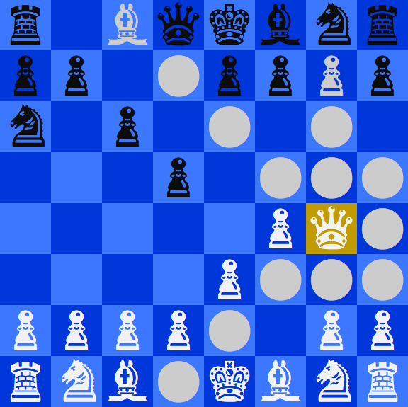

# Chess

## Prerequisites
1. .NET 5.0
## Features
- [x] Abstract piece object class w/ abstract IsLegal method 
- [x] Inherited children for the piece types (King, Queen, Rook, Bishop, Knight, Pawn)
- [x] Board class w/ static methods such as: find, write, and remove. 
- [x] Arrow keys based movement system and 
- [x] Automatically change console font to MS Gothic and font size to 72
- [ ] Checkmate
- [ ] Multiplayer
- [ ] An opponent

## Controls
| Key          | Function           |
| ------------ | ------------------ |
| Up Arrow     | Move cursor up     |
| Down Arrow   | Move cursor down   |
| Left Arrow   | Move cursor left   |
| Right Arrow  | Move cursor right  |
| Enter        | Select             |
| Escape       | Unselect           |
## Credits
Made alongside [Matthew Romano](https://github.com/MatthewDRomano) ([His Chess](https://github.com/MatthewDRomano/Chess))
